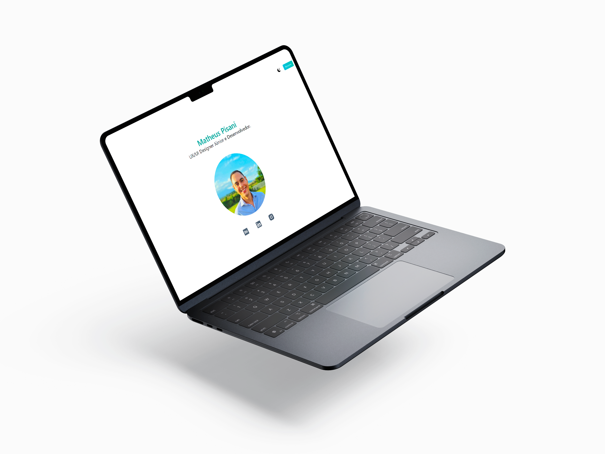

## 🖥️ Projeto
 O Projeto é uma página de Portfólio Online com links para as principais redes sociais.

## 👨🏼‍💻 Tecnologias
Projeto desenvolvido utilizando as seguintes tecnologias JavaScript, React, Next.js, Git e GitHub

## Layout
Você pode visualizar o layout do projeto através [desse link](https://mathpisani.github.io/react-portfolio)
